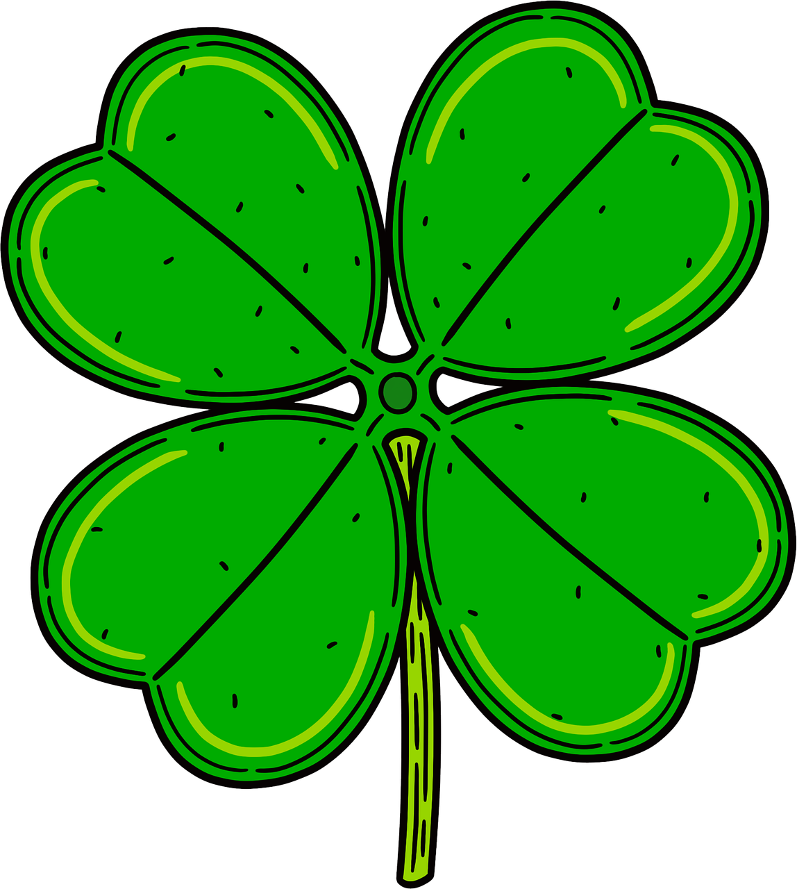

# 🍀 Klasifikasi Sampah Otomatis - Presentasi Data Science

Presentasi interaktif berbasis web tentang sistem klasifikasi sampah otomatis menggunakan teknologi Data Science dan Machine Learning.



## 📋 Deskripsi Project

Project ini merupakan presentasi HTML interaktif yang membahas implementasi sistem klasifikasi sampah otomatis untuk mengatasi masalah pengelolaan sampah di Indonesia. Presentasi ini dibuat dengan desain visual yang menarik dengan tema ramah lingkungan.

### ✨ Fitur Utama

- **Desain Interaktif**: Presentasi dengan efek scroll-snap yang smooth
- **Responsive Design**: Tampilan optimal di berbagai ukuran layar
- **Animasi Halus**: Transisi dan animasi yang menarik
- **Tema Ramah Lingkungan**: Palet warna hijau natural dengan elemen dekoratif
- **Dokumentasi Lengkap**: Dilengkapi dengan file PDF presentasi

## 🎯 Konten Presentasi

Presentasi ini mencakup topik-topik berikut:

1. **Industri Pengelolaan Sampah Indonesia**
   - Statistik produksi sampah nasional
   - Tantangan dalam pengelolaan sampah
   
2. **Identifikasi Masalah**
   - Masalah dalam sistem pengelolaan sampah saat ini
   - Dampak lingkungan dan kesehatan

3. **Solusi Data Science**
   - Implementasi Machine Learning untuk klasifikasi sampah
   - Teknologi yang digunakan

4. **Pipeline Machine Learning**
   - Proses pengumpulan data
   - Preprocessing dan augmentasi
   - Training model
   - Deployment

5. **Hasil dan Evaluasi**
   - Metrik performa model
   - Visualisasi hasil

## 🚀 Cara Menggunakan

### Opsi 1: Langsung Buka File HTML

1. Clone repository ini:
```bash
git clone https://github.com/frizennwave/klasifikasi-sampah-presentation.git
cd klasifikasi-sampah-presentation
```

2. Buka file `index.html` di browser:
```bash
# Di Windows
start index.html

# Di macOS
open index.html

# Di Linux
xdg-open index.html
```

### Opsi 2: Menggunakan Live Server

Jika Anda menggunakan VS Code:

1. Install extension "Live Server"
2. Klik kanan pada `index.html`
3. Pilih "Open with Live Server"

### Opsi 3: Deploy ke GitHub Pages

1. Fork atau clone repository ini
2. Push ke GitHub repository Anda
3. Buka Settings repository
4. Scroll ke bagian "GitHub Pages"
5. Pilih branch `main` dan folder `/ (root)`
6. Klik Save
7. Presentasi akan tersedia di: `https://your-username.github.io/klasifikasi-sampah-presentation/`

## 📁 Struktur Project

```
PPT - Data Science/
├── index.html              # File presentasi utama
├── README.md              # Dokumentasi project
├── docs/
│   └── data-science.pdf   # Dokumen PDF presentasi
└── img/
    └── clover.png         # Asset gambar clover
```

## 🎨 Teknologi yang Digunakan

- **HTML5**: Struktur konten
- **CSS3**: Styling dan animasi
  - CSS Grid & Flexbox untuk layout
  - CSS Animations untuk efek interaktif
  - Custom Properties untuk tema warna
- **Google Fonts**: Typography (Playfair Display & Lora)
- **Scroll Snap API**: Navigasi presentasi

## 🎨 Palet Warna

Project ini menggunakan palet warna ramah lingkungan:

- Forest Dark: `#1a4d2e`
- Forest Main: `#2d6a4f`
- Leaf Green: `#40916c`
- Mint: `#52b788`
- Sage: `#74c69d`
- Light Green: `#95d5b2`
- Cream: `#f8f9fa`

## 📱 Responsiveness

Presentasi ini dioptimalkan untuk berbagai ukuran layar:
- Desktop (1920px+)
- Laptop (1366px - 1920px)
- Tablet (768px - 1366px)
- Mobile (< 768px)

## 📄 Lisensi

Project ini dilisensikan di bawah [MIT License](LICENSE) - lihat file LICENSE untuk detail lebih lanjut.

---

⭐ Jangan lupa berikan star jika project ini bermanfaat!
